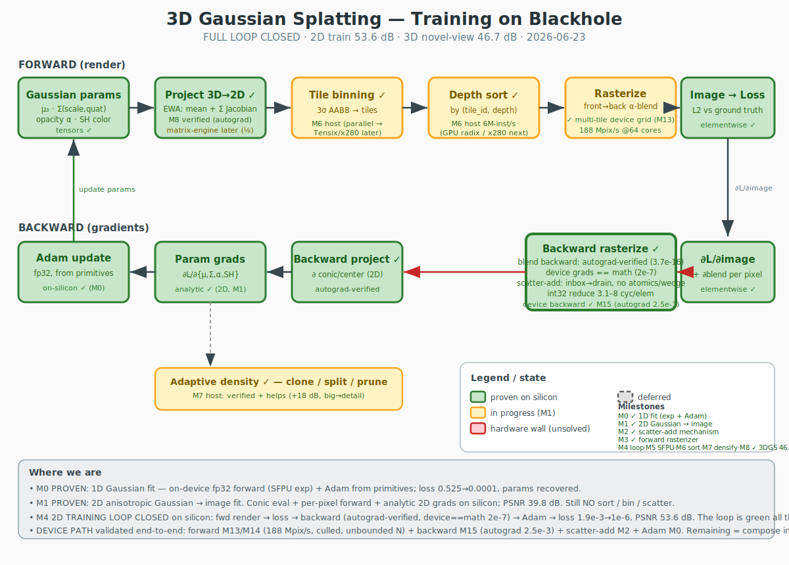

# 3DGS Training on Blackhole — Algorithm Map

This is the full 3D Gaussian Splatting *training* loop, color-coded by how far we've gotten on real
Blackhole silicon. The **green spine** (parameter eval → loss → gradients → Adam) is lit up; the **red
boxes** are the genuine hardware research. See [`../FEASIBILITY.md`](../FEASIBILITY.md) for the deep dive.

| # | Stage | State | Notes / evidence |
|---|---|---|---|
| 1 | **Gaussian params** (μ₃, Σ, α, SH) | 🟢 partial | Params as device tensors + Adam updates proven (M0). Full GS param set not yet laid out. |
| 2 | **Project 3D→2D** (mean + 2D covariance) | 🟡 M1 | 2D covariance eval is what M1 exercises. ⅛ matmul-throughput penalty on tiny 3×3 (`matrix_engine.md:19`) — needs batching. |
| 3 | **Tile binning** (Gaussian → screen tiles) | 🔴 wall | No bincount / variable-length-list primitive. MOE routing is the closest and doesn't fit. |
| 4 | **Depth sort** by (tile_id, depth) | 🔴 wall | Only `topk`/bitonic (bf16, tile-layout, K-aligned). Candidate to offload to **x280**. |
| 5 | **Rasterize** front→back α-blend | 🔴 wall | Per-pixel sequential saturation on a 32×32-tile machine. The *eval* path (Gaussian→pixel, no sort) is ✅ proven (M1); the α-blend/sort remains the wall. |
| 6 | **Image → Loss** (L2 vs GT) | 🟢 proven | Elementwise + reduction; `mse_loss` exists. |
| 7 | **∂L/∂image** (+ ∂blend) | 🟢 proven | Elementwise. |
| 8 | **Backward rasterize → SCATTER-ADD** | 🔴🔴 **the gate** | Many pixels/cores accumulate into one Gaussian. No kernel atomic float-add; CAS idiom is wrong (Tensix atomics are local-L1-only). Crack: native NoC **`noc_accumulate` / `NOC_AT_ACC_FP32`** (M2 probe). |
| 9 | **Backward project** (∂ through Jacobian) | 🟡 | Manual chain rule; same tiny-matmul concern as (2). |
| 10 | **Param grads** ∂L/∂{μ,Σ,α,SH} | 🟢 (2D) | Analytic grads proven through the 2D conic (M1: ∂center, ∂a,∂b,∂c, ∂A); generalize to 3D + SH. |
| 11 | **Adam update** | 🟢 proven (M0) | fp32, built from ttnn primitives (`moreh.adam` is bf16-only **and** broken in this build). |
| 12 | **Adaptive density** clone/split/prune | ⚪ deferred | Dynamic Gaussian count → host orchestration. Out of scope until forward+backward close. |

## Milestones

- **M0 — ✅ proven on silicon.** 1D Gaussian fit: on-device fp32 forward (SFPU `exp`) + Adam from primitives.
  Loss `0.525 → 0.0001`, params recovered. → [`../pathclear/gaussian_fit.py`](../pathclear/gaussian_fit.py)
- **M1 — ✅ proven on silicon.** 2D anisotropic Gaussian → 32×32 image fit. Conic (Σ⁻¹) eval + per-pixel forward
  + analytic 2D gradients on-device; recovered center & conic, **PSNR 39.8 dB**. **Still no sort / bin / scatter.**
  → [`../pathclear/gaussian2d_image.py`](../pathclear/gaussian2d_image.py) · render: `pathclear/m1_target_vs_recovered.png`
- **M2 — ✗ the gate.** Cross-core float scatter-add for backward. Microbenchmark the native NoC FP32 accumulate.
  This decides whether full training is feasible on Blackhole or needs the x280 fallback.
