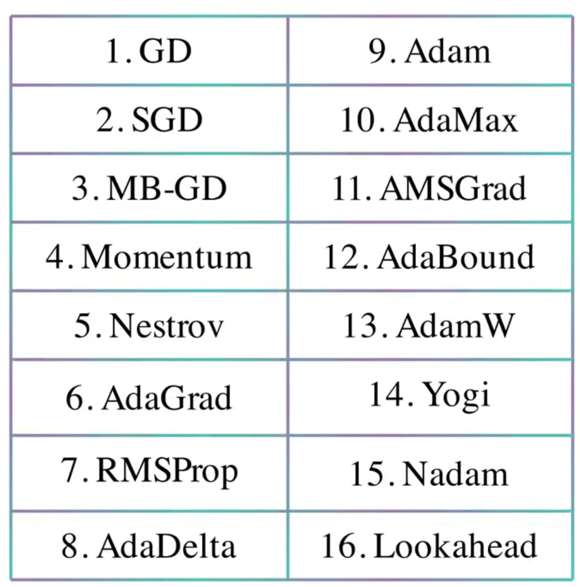

# tt-splat — Prioritized Roadmap

**Feasibility is closed.** The full device-resident 3DGS training loop (project → M14 raster → fused
backward → analytic projection backward → Adam) runs entirely on Blackhole silicon and trains real
captures at 1600px / 50k Gaussians, 1.4k+ iterations stable (see [`PROGRESS.md`](PROGRESS.md)). What
remains is **product**, and it splits three ways: **QUALITY** (does it make good splats of real
scenes?), **SCALE** (millions of Gaussians at full resolution), and **SAFETY** (don't brown out the
850W PSU and reboot the host). This roadmap unifies and sequences two backlogs — (A) feature gaps vs
gsplat and (B) the open engineering threads from the pathclear/scale work — and **cross-references,
does not duplicate**, the four plans of record:
[`SCALE_CAMPAIGN_PLAN.md`](SCALE_CAMPAIGN_PLAN.md) ·
[`PERF_LOCALITY_PLAN.md`](PERF_LOCALITY_PLAN.md) ·
[`PROJECTION_FUSION_PLAN.md`](PROJECTION_FUSION_PLAN.md) ·
[`PROGRESS.md`](PROGRESS.md).

The guiding bet: **the millions endgame is only worth building if it produces *good* splats**, so the
cheap quality wins and the safety guard come first; auto-densification is both a quality win and a
prerequisite for the scale campaign producing usable results; the XL per-step perf work comes last, by
the plans' own deliberate ordering.

Tags: **QUALITY** (splat fidelity) · **SCALE** (N / resolution) · **SAFETY** (host/PSU) ·
**HONESTY** (the dashboard/CLI reflects reality).

---

## NOW — cheap quality wins + the safety guard

These are mostly **host-side scalar/loss changes with zero kernel recompile** (the training loop is
host-orchestrated dispatches; lr/β/ε/thresholds are per-dispatch host values — see
[`PROGRESS.md`](PROGRESS.md) "Metaparam updates"). Highest value per unit effort; do these before
anything structural.

| # | Item | Tag | Effort | What / why | Risk | Deps | Key file(s) |
|---|------|-----|--------|------------|------|------|-------------|
| N1 | **Fix the "ssim" metric label** | HONESTY | S | The dashboard "ssim" metric is actually **PSNR** — `ssim=psnr(...)` at `server/train_tt.py:208,265`. Either rename the field to PSNR or implement real SSIM (N2). Misleading as-is. | none | — | `server/train_tt.py:208,265` |
| N2 | **L1 + D-SSIM loss** | QUALITY | S–M | Training is **pure MSE** today (`train_tt.py:245,251` and the resident path's `loss` from `trainer.step`). gsplat's default is `(1−λ)·L1 + λ·D-SSIM`. SSIM = box-filter means/vars/covar → portable SFPU/eltwise. **Highest-value quality gap.** | low — known-good formula; verify on a real capture | N1 (share the SSIM kernel) | `server/train_tt.py` (loss ~L245/251 host path; `trainer.step` resident path) |
| N3 | **Scene-scale-aware LR + exp LR decay + progressive-SH warmup** | QUALITY | S (each) | LRs are **fixed per-param** (`train_tt.py:154`, `lr={"mean":.01,...}`) and **full SH from step 1** (`train_real.py` `--sh`). Add scene-extent-scaled mean LR, exponential decay, and band-by-band SH warmup. Pure host scalar schedules, **zero recompile**. Lowest-effort high-ROI cluster. | low | — | `server/train_tt.py:154` (lr dict, `make_opt`); SH gating around `train_real.py:31` (`sh_eval`) |
| N4 | **Anti-aliased rasterization (Mip-Splatting opacity comp.)** | QUALITY | S | We apply a fixed `0.3·I` EWA dilation but **not** the AA factor (scale α by `sqrt(det ratio)`). One SFPU scalar per Gaussian; reduces aliasing at low res / when downsampling. | low | — | raster/EWA path in `server/` (raster kernels); conic build mirrors `train2d_densify.py:22` `conic()` |
| N5 | **Power-ramp guard wired into the resident loop** | SAFETY | S–M | Full-grid 1600px can brown out the 850W PSU and **reboot the host** (proven dI/dt). Harness exists at [`docs/pathclear/power_ramp.py`](pathclear/power_ramp.py) (continuous soft-start ramp + bg-thread telemetry + abort) but is **not** wired into the live loop. **Prerequisite for scaling worker-grid load.** | host reboot if skipped — this is the gate on everything in NEXT/LATER that raises grid load | — | resident loop in `server/train_tt.py:166–211`; `docs/pathclear/power_ramp.py` |

---

## NEXT — functional density + the scale substrate

Auto-densification is the **biggest functional gap vs gsplat** and the prerequisite for the millions
endgame producing good splats. The GDDR substrate is the prerequisite for going past the ~32k single-core
sort cap. See [`SCALE_CAMPAIGN_PLAN.md`](SCALE_CAMPAIGN_PLAN.md) for the capacity math (~944 B/Gaussian →
L1 fits only ~175k).

| # | Item | Tag | Effort | What / why | Risk | Deps | Key file(s) |
|---|------|-----|--------|------------|------|------|-------------|
| X1 | **Automatic adaptive densification (gsplat DefaultStrategy)** | QUALITY+SCALE | M | grad-threshold **clone/split + prune + opacity reset** (refine_every 100, from 500 until 15000, grow_grad2d 2e-4). Operators are **proven** in [`docs/pathclear/train2d_densify.py`](pathclear/train2d_densify.py) (`densify()` L53, +18 dB) but **not wired into the live loop** — today only manual `prune` (`train_tt.py:222`) + one-shot `TT_TARGET_POINTS` replication. **Biggest functional gap.** | M — host-orchestrated structural realloc; rebuilds buffers (couples to GDDR-realloc); resident mode currently **skips** structural commands (`train_tt.py:187–189`) | N5 (load guard); pairs with GDDR-realloc (X3) | `server/train_tt.py:187–189,222–237`; operators from `docs/pathclear/train2d_densify.py:53` |
| X2 | **MCMC densification strategy (relocate/add under cap_max)** | QUALITY+SCALE | M | Relocate/add by opacity under a fixed cap; **bounded-cap fits Blackhole better than unbounded realloc** (the L1/GDDR budget is fixed). Pairs with **scale + opacity regularization** (also absent). Host-side bookkeeping + sampling. | M — needs the reg terms too | X1 substrate (shared structural-realloc plumbing) | `server/train_tt.py` (structural-realloc path, shared with X1) |
| X3 | **Full GDDR param streaming (zero host arg-pack) + `sgid`→DRAM** | SCALE | L | Device bin/sort caps at **32k** (single-core L1); lift sort past 32k → 50k+ by streaming params/sgid from GDDR instead of host arg-pack. Removes the last host arg-pack hop. **Plan of record:** [`SCALE_CAMPAIGN_PLAN.md`](SCALE_CAMPAIGN_PLAN.md). | M–L — GDDR addressing + the small-GDDR-window gotcha | builds on `server/device_binsort.py`, `server/raster_blocked.py` | `server/device_binsort.py`; `server/raster_blocked.py`; see `SCALE_CAMPAIGN_PLAN.md` |
| X4 | **Camera pose optimization** | QUALITY | M | Poses are **fixed from COLMAP** today. Tractable because the **analytic projection backward already exists** (`device_project_backward` / Stage A). Real-data payoff (jitter/calibration). | M — add pose params to the optimizer + projection-bwd wrt extrinsics | the analytic projection backward (already resident) | projection backward (`device_project_backward`); optimizer setup `train_tt.py:152–156` |

---

## LATER — the millions endgame + the XL per-step perf work

These are **L–XL** and **deliberately deferred** by the plans of record — near-zero value at the measured
N, and each depends on the prior stages. Do them *after* the scale campaign is producing good splats.

| # | Item | Tag | Effort | What / why | Risk | Deps | Key file(s) |
|---|------|-----|--------|------------|------|------|-------------|
| L1 | **On-device densification toward MILLIONS** (structural GDDR realloc of param/Adam/grad tensors) | SCALE | L–XL | The headline endgame — L1 fits only ~175k, so millions must be **GDDR-resident**; structural realloc of params + Adam m/v + grad tensors on device. | high — capacity + correctness under realloc | X1/X2 (densify logic), X3 (GDDR streaming) | `SCALE_CAMPAIGN_PLAN.md`; `server/device_binsort.py` |
| L2 | **On-die sort for >1M** (multi-core owner-scatter, the m2_scatter_gather pattern) | SCALE | L | Lift sort past the single-core ceiling via the proven contention-free owner-scatter. Deferred. | med | L1; `m2_scatter_gather` pattern | `docs/pathclear/m2_scatter_gather.py`; `SCALE_CAMPAIGN_PLAN.md` |
| L3 | **Perf-locality owner-reduce** (grads resident A→D→C, hash-home single-writer) | SCALE | XL | [`PERF_LOCALITY_PLAN.md`](PERF_LOCALITY_PLAN.md) **Stages 5–6**: on-die per-tile reduce + computed hash-home destination so grads never round-trip host. **Stages 1–3 landed** (Stage A 320→70ms). Needs the router-gap physical-core lookup. | XL — router-gap lookup; 2e-2 grad gate | Stages 1–3 (landed) | `PERF_LOCALITY_PLAN.md`; `server/device_resident.py`, fused-backward path |
| L4 | **Projection fusion Steps 3–5** | SCALE | XL | [`PROJECTION_FUSION_PLAN.md`](PROJECTION_FUSION_PLAN.md): **Step 2 (SH/color) is live** (D 44.5→29.6ms); remaining = Step 3 geometry, Step 4 hard gscale/gquat, Step 5 forward B. Target B+D **57.5 → ~3–5ms**. | XL — dst-budget (8 fp32) + FIFO-hazard constraints | Step 2 (landed) | `PROJECTION_FUSION_PLAN.md`; `device_project.py`, `device_project_backward.py` |

---

## Recently shipped this session (so the roadmap reflects current reality)

- **Dashboard tooltips + a controls explainer** — [`docs/controls.html`](controls.html) (what every
  knob/metric on `/training` does).
- **Algorithm animation** — [`docs/algorithm_anim.html`](algorithm_anim.html) (the pipeline, animated).
- **In progress:** command-wiring **honesty** (resident mode currently *prints* "command not supported"
  for prune/reset/clamp/set_lr at `train_tt.py:187–189` — surface this in the UI), **tt-smi telemetry**,
  and a **`--profile` compute-util** readout. These motivate N1 (the metric-label fix) and N5 (the power
  guard telemetry) directly.

---

## Sequencing recommendation

Do the **NOW** block first: the metric-label fix (N1), L1+D-SSIM (N2), the LR/SH schedules (N3), and AA
(N4) are cheap host-side changes that materially improve splat quality on real scenes with **zero kernel
recompile**, and the **power-ramp guard (N5)** is a hard safety gate on *everything* that raises worker-grid
load — wire it in before you push the grid harder. Then do **auto-densification (X1)**: it is the biggest
functional gap *and* the prerequisite for the millions endgame to produce **good** splats — there is no
point scaling to millions of Gaussians that densification can't place well. Then run the **scale campaign**
(X2/X3 → the L-block endgame) per [`SCALE_CAMPAIGN_PLAN.md`](SCALE_CAMPAIGN_PLAN.md). Save the **XL per-step
perf work** (L3 owner-reduce, L4 projection-fusion Steps 3–5) for **last** — this is the plans-of-record's
**deliberate ordering inversion**: capacity/quality before per-step latency, because the XL perf work has
near-zero value until N and resolution are actually large and the splats are actually good.

---
## Optimizers

  - Add in adamw support with appropriate metas
  - Add in muon support with appropriate metas
  - Add in rmsprop support with appropriate metas
  - Add in adagrad support with appropriate metas
  - Ensure frontend adds explainations/cartoons and clean tooltips for user understanding
  - explore interactive user weighting/input for optimizers, human can easily *see* where gaussions need love, how to incorporate this

---
## Moonshot — the Splatting Game (crowdsourced reconstruction / GWAP) 🫧🔫

The interactive **splat tool** (bubble gun + eraser, shipped) is the seed of something bigger. The thesis
running through this whole project: a human can ID floaters / missing detail / fog in a single image in
**milliseconds — faster than any silicon** — so the *spatial reasoning* half of 3DGS reconstruction
(densify here, cull the fog there, seed structure) is exactly the kind of task crowds will do **free, for
fun**. Foldit (protein folding), the ESP Game (image labels), and reCAPTCHA (OCR/segmentation) all proved
it: wrap a useful-but-hard spatial task in a game and the crowd *becomes* the compute. This is a
**game-with-a-purpose (GWAP)** for Gaussian splatting — humans do the irregular spatial judgment, the
Blackhole does the dense optimization. Best of both compute platforms.

**The pitch:** a free browser game. You get a half-built splat scene + its reference photos; you *shoot
bubbles* to fill detail and *vacuum* the fog. **Score = error you removed** (Δloss / ΔPSNR per trigger
pull) — the loss function *is* the score function, so the game is self-grading and the reward is perfectly
aligned with reconstruction quality. Edits stream into a device-resident trainer that refines between
rounds.

**Business model (per the Gnomes):**
  1. Collect splats 🫧
  2. **?????**
  3. Profit 🧦

  *(Phase-2 candidates, sober edition: the game outputs a clean, human-curated 3DGS dataset — the thing
  every spatial-AI / robotics / AR shop pays to capture today; or reconstruction-as-a-service with the crowd
  as labor; or just the chillest way on earth to make splats. The dataset is the underpants.)*

**What it would actually take (engine backlog):**
  - **Live in-browser splat renderer** (WebGL/WebGPU) — today the tool is mouse-POST → next training step;
    a game needs real-time orbit + aim with edits reconciled server-side. **The single biggest lift, and the
    one piece that turns "edit-and-wait" into "a game" — prototype this first.**
  - **Session / multiplayer infra** — scene check-out, concurrent editors, edit-merge, the trainer as
    authoritative state, rounds/turns, spectating.
  - **Scoring + reward** — attribute Δloss/ΔPSNR to each player's bubbles/culls (we already stream per-stage
    loss), leaderboards, streaks, combos.
  - **Anti-griefing** — the eraser is abusable (vacuum the whole scene); needs edit budgets, undo,
    trust/reputation, N-player consensus before a destructive cull lands, and "training out-votes a bad edit
    anyway" as a backstop.
  - **Free-view camera** — orbit/navigate beyond the fixed training cameras (couples to pose/novel-view).
  - **Capture→game pipeline + onboarding** — `ttgs sfm` already does capture→poses; add a scene library, a
    30-second tutorial, and the 🫧 juice (bubble physics, pops, particles — reuse the `algorithm_anim.html`
    aesthetic).
  - **Human-weighted optimizer hook** — same thread as the [Optimizers](#optimizers) note above: the game
    *is* the UI for human gradient-weighting ("where the gaussians need love").

Status: **vision / parked.** The interactive splat tool is the working nucleus; everything above is the
engine around it. Build the live WebGL viewer first.

ok, i need to test this wit h a real training run, is there a way to do like interactive sfm/densification? Like I said humans are actually really good at these spatial tasks  so makes sense to offload to the more efficient compute platform